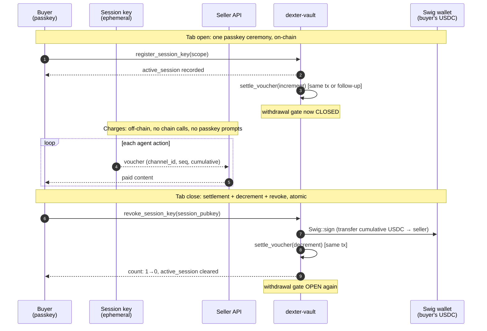
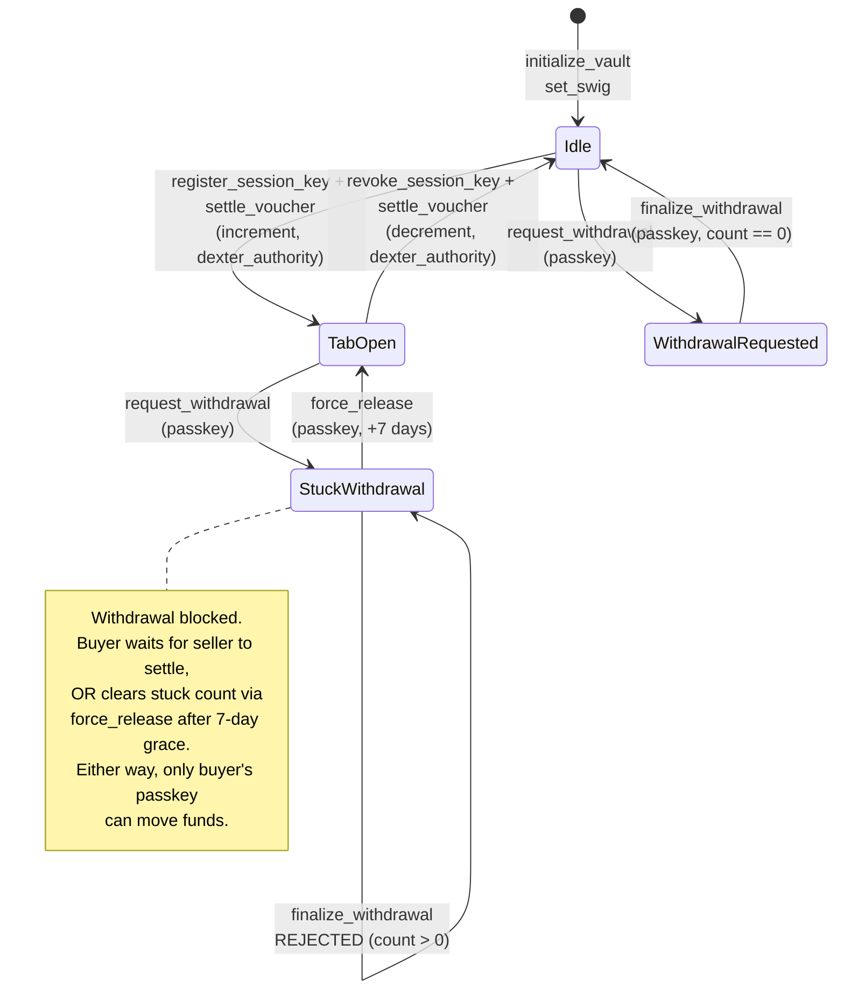

<p align="center">
  
</p>

<h1 align="center">dexter-vault</h1>

<p align="center">
  <strong>An on-chain implementation of the Open Tabs Standard. The buyer's USDC never leaves their wallet; the program gates the exit while a tab is open.</strong>
</p>

<p align="center">
  <a href="https://solscan.io/account/Hg3wRaydFtJhYrdvYrKECacpJYDsC9Px7yKmpncj2fhc"></a>
  
  <a href="https://www.anchor-lang.com"></a>
  
  
  <a href="./LICENSE"></a>
  <a href="./SECURITY.md"></a>
</p>

<p align="center">
  <a href="https://github.com/Dexter-DAO/dexter-x402-sdk">x402 SDK</a>
  · <strong>Vault</strong>
  · <a href="https://github.com/Dexter-DAO/dexter-mcp">MCP</a>
  · <a href="https://x402.dexter.cash">Facilitator</a>
  · <a href="https://dexter.cash">dexter.cash</a>
</p>

---

Agentic payments need three properties at once. No prior approach delivers all three.

| Approach | Non-custodial | Streaming | Seller-protected |
|---|:---:|:---:|:---:|
| One-shot blockchain payment | ✓ | ✗ | ✓ |
| Lightning / payment channels | ✓ (escrow) | ✓ | ✓ |
| Custodial wallet (Crossmint, CDP) | ✗ | partial | ✓ |
| Pre-funded wallet, no gate | ✓ | ✓ | ✗ (buyer can drain) |
| **Open Tabs Standard** | **✓ (no escrow)** | **✓** | **✓** |

The Open Tabs Standard gets all three by gating the buyer's exit instead of escrowing the buyer's funds. The closest mental model is an auth-and-capture credit-card hold, with on-chain enforcement of the hold.

---

## Open Tabs Standard

[OTS](./docs/OTS-STANDARDS-PROPOSAL.md) is a protocol specification for streaming payments rooted in a buyer-controlled wallet. The standard defines the account shape, the instruction surface, the off-chain voucher format, and the security properties an implementation must preserve. Any program that preserves them is OTS-compliant and interoperable with any conforming facilitator or seller middleware.

This repo is one such implementation, deployed and live. Others are welcome.

---

## Program

dexter-vault is an Anchor program with one account type (`Vault`) and eleven instructions across roughly 1,200 lines of Rust. The program holds no funds; it records bindings and enforces a withdrawal gate.

- **Funds stay in the buyer's wallet.** No escrow account, no custodian. The program is bookkeeping plus a gate.
- **The buyer's withdrawal is gated on-chain.** While any spending authorization is open, withdrawal is rejected. Even the buyer's own passkey signature is insufficient.
- **Only the buyer's passkey can ever move funds out.** Verified on-chain by Solana's secp256r1 precompile (SIMD-0075). The facilitator never holds a key that can drain the wallet.

Program: [`Hg3wRaydFtJhYrdvYrKECacpJYDsC9Px7yKmpncj2fhc`](https://solscan.io/account/Hg3wRaydFtJhYrdvYrKECacpJYDsC9Px7yKmpncj2fhc) on Solana mainnet.

---

## Try it

The following calls the live mainnet program. No SOL required, no funds at risk. A randomly-generated passkey tries to prove it owns vault [`7FE9…WAi`](https://solscan.io/account/7FE9VUeabi3sF8wUABV7F3eyvEi1ekDbER9k5JBYrWAi); the program refuses.

```bash
git clone https://github.com/Dexter-DAO/dexter-vault.git
cd dexter-vault
npm install
RPC=https://api.mainnet-beta.solana.com node prove-passkey-mainnet.mjs
```

Expected output:

```
Live vault : 7FE9VUeabi3sF8wUABV7F3eyvEi1ekDbER9k5JBYrWAi
Program    : Hg3wRaydFtJhYrdvYrKECacpJYDsC9Px7yKmpncj2fhc (deployed prove_passkey)
Test       : a WRONG passkey signs the challenge → live mainnet program must REJECT

simulate err : {"InstructionError":[...]}
VERDICT: REJECTED. prove_passkey is LIVE on mainnet and refuses a forged passkey for vault 7FE9.
```

The real passkey for that vault is on a buyer's device. The program enforces ownership without holding any key.

---

## Account layout

The `Vault` is a PDA derived from the first 16 bytes of `identity_claim`. The first byte is a version tag; all instructions assert `version == 2`.

| Field | Type | Notes |
|---|---|---|
| `version` | `u8` | `2` for the current layout. Lets future migrations reject stale clients with a clear error |
| `bump` | `u8` | PDA bump |
| `passkey_pubkey` | `[u8; 33]` | The buyer's secp256r1 (P-256) public key, the root withdrawal authority |
| `swig_address` | `Pubkey` | The bound Swig wallet. Zero until `set_swig`, immutable after |
| `cooling_off_seconds` | `u32` | Configurable delay between `request_withdrawal` and `finalize_withdrawal` |
| `pending_voucher_count` | `u32` | Outstanding tabs. The withdrawal gate. Withdrawal blocked while > 0 |
| `pending_withdrawal` | `Option<PendingWithdrawal>` | Active withdrawal intent (amount, destination, requested-at) |
| `identity_claim` | `[u8; 32]` | Opaque caller-defined handle. No PII on-chain. First 16 bytes are the PDA seed |
| `dexter_authority` | `Pubkey` | The facilitator key permitted to move `pending_voucher_count`. Recorded at init, rotatable only by itself |
| `active_session` | `Option<SessionRegistration>` | The session-key registration authorizing off-chain voucher signing for the current tab. See [Session keys](#session-keys) |

---

## Instructions

| Instruction | Authority | Description |
|---|---|---|
| `initialize_vault` | Setup payer | Creates the `Vault` PDA, records the passkey pubkey, the facilitator authority, the cooling-off period, and the identity_claim |
| `set_swig` | **Buyer's passkey** | Binds the vault to a Swig wallet address. Settable exactly once; cannot be rebound |
| `settle_voucher` | **Facilitator authority** (`has_one`) | Increments/decrements `pending_voucher_count` as tabs open and settle. Bound to the `dexter_authority` recorded at init. No other signer can move the counter |
| `request_withdrawal` | **Buyer's passkey** (secp256r1) | Records a withdrawal intent. No funds move. Requires a WebAuthn assertion verified by the secp256r1 precompile |
| `finalize_withdrawal` | **Buyer's passkey** (secp256r1) | Releases funds, only if `pending_voucher_count == 0` and the cooling-off has elapsed |
| `force_release` | **Buyer's passkey** (secp256r1) | Buyer's recovery path. Releases a tab the facilitator never settled, after a 7-day grace from `request_withdrawal`. Decrements the counter only; moves no funds |
| `rotate_passkey` | **Buyer's current passkey** | Rotates the root passkey. The current passkey must sign the new one |
| `rotate_dexter_authority` | **Current facilitator authority** | Rotates the facilitator authority. The current authority must sign the new one |
| `prove_passkey` | **Buyer's passkey** (secp256r1) | Read-only proof of control. Verifies the passkey signed a challenge and mutates nothing. The non-custodial basis for sign-in and identity. Solana analogue of EIP-1271 |
| `register_session_key` | **Buyer's passkey** (secp256r1) | Authorizes an ephemeral keypair to sign vouchers within a defined scope (counterparty, max cumulative amount, expiry). One passkey signature opens a tab; the session key signs the per-chunk vouchers that follow |
| `revoke_session_key` | **Buyer's passkey** (secp256r1) | Tears down the active session. The revocation message binds to the exact session pubkey it revokes, preventing replay against a later session |

---

## Session keys

A passkey is expensive to invoke. Every signature requires a biometric or hardware prompt. Streaming consumption (LLM tokens, bytes, video frames) produces hundreds of micro-charges per session. The buyer cannot tap their fingerprint per chunk.

A session key resolves the conflict. The buyer's passkey signs one 180-byte registration message that authorizes an ephemeral keypair, scoped to a specific counterparty, capped at a maximum cumulative amount, and bounded by a wall-clock expiry. The session key then signs vouchers freely within that scope. Revocation requires another passkey signature, this one binding to the exact session pubkey being revoked.

Where the session keypair physically lives is a deployment choice and does not change the protocol:

- **Buyer-held.** The keypair stays in the buyer's device memory (browser, app). The seller verifies the registration once per session and the session-key signature per voucher. There is no middleman in the per-chunk path.
- **Facilitator-held.** The keypair lives on a server the buyer authorized in the registration ceremony. Useful for institutional setups or hosted agents that need to stream from a backend. The facilitator is not a trusted third party; its authority comes from a passkey signature with a fixed scope it cannot exceed.

Both variants use the same `register_session_key` instruction. Both produce vouchers a seller verifies the same way. The on-chain enforcement is identical.

---

## Tab lifecycle

One tab, end to end. The buyer's passkey signs the boundaries. The session key (or the facilitator, depending on deployment) signs the per-chunk vouchers in between. The vault enforces the gate.



The on-chain hops carry the tab boundaries: open (register session + increment counter, gate closes), close (Swig transfer + decrement + revoke session in one transaction, gate opens), and withdraw when the buyer wants out (passkey-signed, blocked while count > 0). Everything in between is off-chain.

---

## Withdrawal gate

The load-bearing invariant, drawn as state. `pending_voucher_count` is the only thing standing between the buyer's passkey and their USDC.



`force_release` is the recovery valve. It lets the buyer's own passkey decrement a stuck count after 7 days of seller silence, so an abandoned tab can never permanently freeze funds. It moves no money. The buyer still calls `finalize_withdrawal` separately under the normal gate.

---

## Security

The properties the program enforces on-chain, in order of how load-bearing they are:

- **Passkey-only withdrawal.** `request_withdrawal`, `finalize_withdrawal`, `force_release`, `rotate_passkey`, `register_session_key`, and `revoke_session_key` all require a WebAuthn assertion verified by the secp256r1 precompile against the vault's recorded `passkey_pubkey`. No other key can authorize any of these.
- **Withdrawal gated on open tabs.** `pending_voucher_count > 0` rejects `finalize_withdrawal` unconditionally. The buyer's own passkey is insufficient to escape an open tab.
- **Counter bound to a specific authority.** `pending_voucher_count` only moves when signed by the `dexter_authority` recorded at init, enforced by Anchor's `has_one`. The buyer cannot clear their own gate; an unrelated key cannot touch it at all.
- **Bounded session role.** Session-key registrations specify a counterparty, a max cumulative amount, and an expiry. The on-chain account stores the scope; the off-chain seller middleware verifies vouchers against it. Spend beyond the cap or the counterparty produces an invalid voucher.
- **Revocation binds to the revoked key.** The 128-byte revocation message includes the specific session pubkey it targets. Replaying an old revocation against a newer session is rejected by the program.
- **Key rotation is self-witnessed.** The buyer's current passkey signs the new passkey; the current facilitator authority signs the new facilitator authority. No third party can rotate either.
- **No fund custody.** dexter-vault never moves money. Funds move via Swig, signed by the session role the buyer's passkey authorized. No instruction can cause funds to leave without that signature path.

This protects the buyer's custody and the seller's payment without either party trusting the other. It is not a claim of perfect safety in every dimension. The trust assumptions, the known limits, and the full threat model are in [`SECURITY.md`](./SECURITY.md).

**Audit status.** Not yet externally audited. Funding is in flight. The audit report and any findings will be published in this repo. Responsible disclosure: open an issue or email branch@dexter.cash.

---

## Interop

dexter-vault is one OTS-compliant implementation. The [standards proposal](./docs/OTS-STANDARDS-PROPOSAL.md) specifies the normative requirements: wallet shape, instruction surface, voucher format, security properties. Any program preserving them is interoperable with any conforming facilitator and seller middleware. Other implementations on Solana or other chains are encouraged.

Dexter's own buyer-side implementation against this program lives in [`dexter-api`](https://github.com/Dexter-DAO/dexter-api) (passkey enrollment, vault provisioning, state resolution, withdrawal flows). The x402 settlement counterpart lives in [`dexter-facilitator`](https://github.com/Dexter-DAO/dexter-facilitator).

---

## Build and test

```bash
anchor build          # build the program
anchor test           # run the suite, including adversarial drain-attempt
```

Program ID is pinned in [`Anchor.toml`](./Anchor.toml). The test suite runs against mainnet (the secp256r1 precompile is mainnet-only) at `finalized` commitment for determinism. See [`tests/helpers/secp256r1.ts`](./tests/helpers/secp256r1.ts).

---

## Documentation

| Document | What it covers |
|---|---|
| [`ARCHITECTURE.md`](./ARCHITECTURE.md) | End-to-end system design, the four-program streaming flow, off-chain receipt protocol |
| [`SECURITY.md`](./SECURITY.md) | Threat model, trust assumptions, enforced invariants, known-issue registry |
| [OTS Standards Proposal](./docs/OTS-STANDARDS-PROPOSAL.md) | The standard this implements: wallet shape, interface, security properties, adoption path |
| [OTS Technical Brief](./docs/OTS-TECHNICAL-BRIEF.md) | Implementer-facing summary for second and third implementers |

This repo is [MIT licensed](./LICENSE).

---

<p align="center">
  <a href="https://dexter.cash">dexter.cash</a>&nbsp;&nbsp;&middot;&nbsp;&nbsp;
  <a href="https://x402.org">x402.org</a>&nbsp;&nbsp;&middot;&nbsp;&nbsp;
  <a href="https://twitter.com/dexteraisol">@dexteraisol</a>&nbsp;&nbsp;&middot;&nbsp;&nbsp;
  <a href="https://twitter.com/BranchM">@BranchM</a>
</p>
