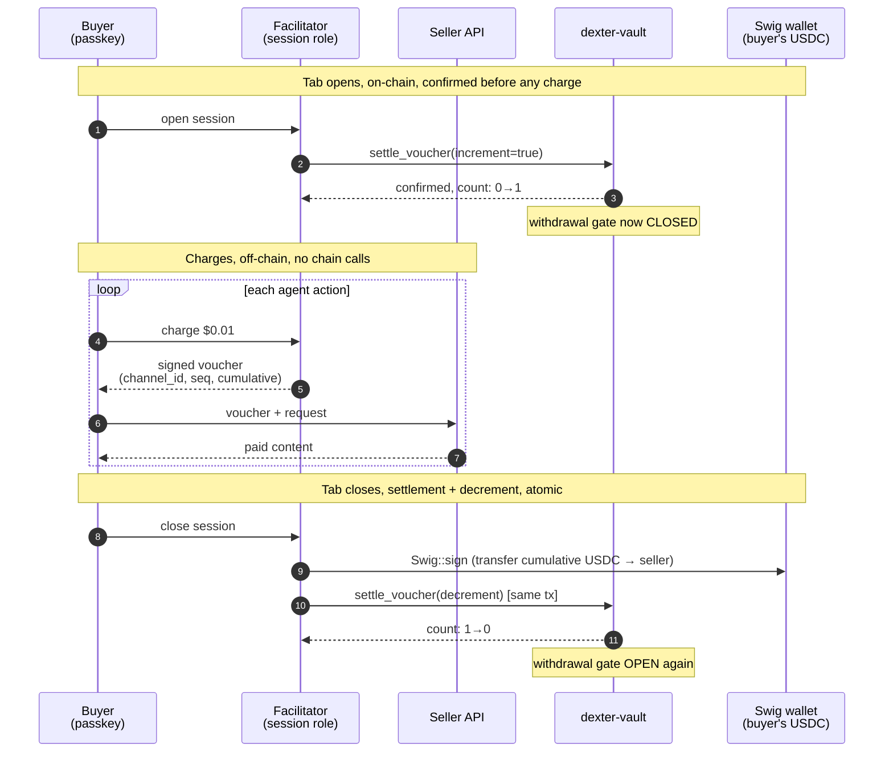
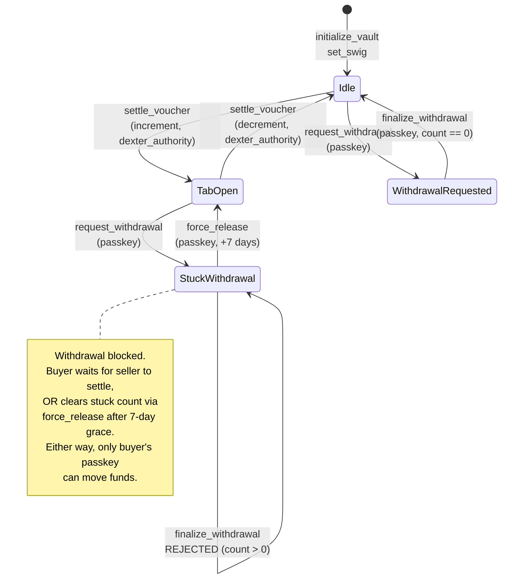

<p align="center">
  
</p>

<h1 align="center">dexter-vault</h1>

<p align="center">
  <strong>Non-custodial, non-escrow spending authorizations on Solana. Your USDC never leaves your wallet. The program locks the exit, not the money.</strong>
</p>

<p align="center">
  <a href="https://solscan.io/account/Hg3wRaydFtJhYrdvYrKECacpJYDsC9Px7yKmpncj2fhc"></a>
  
  <a href="https://www.anchor-lang.com"></a>
  
  
  <a href="./LICENSE"></a>
  <a href="./SECURITY.md"></a>
</p>

<p align="center">
  <a href="https://github.com/Dexter-DAO/dexter-x402-sdk">x402 SDK</a>
  · <strong>Vault</strong>
  · <a href="https://github.com/Dexter-DAO/dexter-mcp">MCP</a>
  · <a href="https://x402.dexter.cash">Facilitator</a>
  · <a href="https://dexter.cash">dexter.cash</a>
</p>

---

## The problem this solves

Agentic payments need three properties at once. No prior standard delivers all three.

| Approach | Non-custodial | Streaming | Seller-protected |
|---|:---:|:---:|:---:|
| One-shot blockchain payment | ✓ | ✗ | ✓ |
| Lightning / payment channels | ✓ (escrow) | ✓ | ✓ |
| Custodial wallet (Crossmint, CDP) | ✗ | partial | ✓ |
| Pre-funded wallet, no gate | ✓ | ✓ | ✗ (buyer can drain) |
| **Open Tabs Standard** | **✓ (no escrow)** | **✓** | **✓** |

The Open Tabs Standard gets all three by gating the buyer's exit instead of escrowing the buyer's funds. The closest mental model is an auth-and-capture credit-card hold, with on-chain enforcement of the hold.

---

## What this is

dexter-vault is the on-chain reference implementation of the [Open Tabs Standard](./docs/OTS-STANDARDS-PROPOSAL.md). It is the protocol that lets an agent stream payments from a user's wallet without escrow and without custody.

- **Funds stay in the buyer's wallet.** No escrow account, no custodian. The program is bookkeeping plus a gate.
- **The buyer's withdrawal is gated on-chain.** While any spending authorization is open, withdrawal is rejected. Even the buyer's own passkey signature is insufficient.
- **Only the buyer's passkey can ever move funds out.** Verified on-chain by Solana's secp256r1 precompile (SIMD-0075). The facilitator never holds a key that can drain the wallet.
- **Nine instructions. One account. ~575 lines of Rust.** Small on purpose.

Program: [`Hg3wRaydFtJhYrdvYrKECacpJYDsC9Px7yKmpncj2fhc`](https://solscan.io/account/Hg3wRaydFtJhYrdvYrKECacpJYDsC9Px7yKmpncj2fhc) on Solana mainnet.

---

## Try it in 30 seconds

This calls the live mainnet program and verifies that a forged passkey is rejected. No SOL required. No funds at risk. The script signs with a randomly-generated passkey, asks the on-chain `prove_passkey` instruction to verify it owns vault [`7FE9…WAi`](https://solscan.io/account/7FE9VUeabi3sF8wUABV7F3eyvEi1ekDbER9k5JBYrWAi), and the program refuses.

```bash
git clone https://github.com/Dexter-DAO/dexter-vault.git
cd dexter-vault
npm install
RPC=https://api.mainnet-beta.solana.com node prove-passkey-mainnet.mjs
```

Expected output:

```
Live vault : 7FE9VUeabi3sF8wUABV7F3eyvEi1ekDbER9k5JBYrWAi
Program    : Hg3wRaydFtJhYrdvYrKECacpJYDsC9Px7yKmpncj2fhc (deployed prove_passkey)
Test       : a WRONG passkey signs the challenge → live mainnet program must REJECT

simulate err : {"InstructionError":[...]}
VERDICT: REJECTED. prove_passkey is LIVE on mainnet and refuses a forged passkey for vault 7FE9.
```

That is the non-custodial property, demonstrated against production. The vault's real passkey is on a buyer's device; the program enforces ownership without holding any key.

---

## How it works

A buyer's [Swig](https://github.com/anagram-xyz/swig) smart-wallet is rooted in a passkey-secured WebAuthn key and bound to a vault PDA. The vault delegates a bounded session role to a facilitator (token-spend cap, TTL, program scope, all enforced by the Swig program). The buyer spends through that role indefinitely with no per-transaction signatures, while the vault enforces one invariant on-chain.

- **Your passkey is the root authority.** Only a WebAuthn assertion from your device can initiate a withdrawal, verified on-chain via Solana's secp256r1 precompile (SIMD-0075). The facilitator never holds a key that can move your funds out.
- **The facilitator's session role is bounded.** Token-spend cap plus TTL plus program scope, enforced by Swig, not by trust.
- **Open tabs veto withdrawals.** `pending_voucher_count` is the load-bearing gate. While it is non-zero, `finalize_withdrawal` is rejected and the buyer's own passkey signature is insufficient. This is the mechanism that lets a seller safely extend a tab. Exercised by [`tests/drain-attempt.ts`](./tests/drain-attempt.ts), which opens a tab, confirms the mid-session drain is rejected, settles, then confirms withdrawal succeeds.
- **Only the recorded authority moves the counter.** `pending_voucher_count` is bound to the `dexter_authority` stored on the vault at creation. A transaction that touches the counter must be signed by that exact key. A buyer cannot clear their own gate to escape an open tab, and an unrelated key cannot touch it at all.
- **The buyer can always reach their funds.** If a settlement is ever abandoned and a tab is left open indefinitely, the buyer's passkey can release the stuck count itself, but only after a 7-day grace window measured from their withdrawal request. That window is the seller's guaranteed settlement period, so this is a recovery path for abandoned tabs, never an escape from active ones. Access to your money never depends on the facilitator's cooperation.

Charges *against* an open tab are off-chain signed receipts ("vouchers") that sellers verify locally. Only tab open and close touch the chain. See [`ARCHITECTURE.md`](./ARCHITECTURE.md) for the end-to-end flow and the off-chain receipt protocol.

---

## Tab lifecycle

One tab, end to end. The buyer's passkey signs the boundaries. The facilitator runs the meter. The vault enforces the gate.



The three on-chain hops carry the whole protocol: open (increment, gate closes), close (Swig transfer plus decrement in one transaction, gate opens), and withdraw when the buyer wants out (passkey-signed, blocked while count > 0). Everything in between is off-chain signed receipts.

---

## Withdrawal gate

The load-bearing invariant, drawn as state. `pending_voucher_count` is the only thing standing between the buyer's passkey and their USDC.



`force_release` is the recovery valve. It lets the buyer's own passkey decrement a stuck count after 7 days of seller silence, so an abandoned tab can never permanently freeze funds. It moves no money. The buyer still calls `finalize_withdrawal` separately under the normal gate.

---

## Instructions

| Instruction | Authority | Description |
|---|---|---|
| `initialize_vault` | Setup payer | Creates the `Vault` PDA, records the passkey pubkey, the facilitator authority, and the cooling-off period |
| `set_swig` | **Buyer's passkey** | Binds the vault to a Swig wallet address. **Settable exactly once**, cannot be rebound |
| `settle_voucher` | **Facilitator authority** (`has_one`) | Increments/decrements `pending_voucher_count` as tabs open and settle. Bound to the `dexter_authority` recorded at init. No other signer can move the counter |
| `request_withdrawal` | **Buyer's passkey** (secp256r1) | Records a withdrawal intent. No funds move. Requires a WebAuthn assertion verified by the secp256r1 precompile |
| `finalize_withdrawal` | **Buyer's passkey** (secp256r1) | Releases funds, **only if** `pending_voucher_count == 0` and the cooling-off has elapsed |
| `force_release` | **Buyer's passkey** (secp256r1) | Buyer's recovery path. Releases a tab the facilitator never settled, but only after a 7-day grace from `request_withdrawal`. Decrements the counter only, and moves no funds |
| `rotate_passkey` | **Buyer's current passkey** | Rotates the root passkey. The current passkey must sign the new one |
| `rotate_dexter_authority` | **Current facilitator authority** | Rotates the facilitator authority. The current authority must sign the new one |
| `prove_passkey` | **Buyer's passkey** (secp256r1) | Read-only proof of control. Verifies the passkey signed a challenge (`"siwx_login" \|\| challenge`) and mutates nothing. A verifier simulates `[secp256r1_verify, prove_passkey]`; `err == null` proves the passkey owns the vault. The non-custodial basis for sign-in and identity (the Solana analogue of EIP-1271) |

---

## The `Vault` account

| Field | Type | Notes |
|---|---|---|
| `bump` | `u8` | PDA bump |
| `passkey_pubkey` | `[u8; 33]` | The buyer's secp256r1 (P-256) public key, the root withdrawal authority |
| `dexter_authority` | `Pubkey` | The facilitator key permitted to move `pending_voucher_count`. Recorded at init, rotatable only by itself |
| `swig_address` | `Pubkey` | The bound Swig wallet. Zero until `set_swig`, immutable after |
| `cooling_off_seconds` | `i64` | Configurable delay between `request_withdrawal` and `finalize_withdrawal` |
| `pending_voucher_count` | `u32` | Outstanding tabs. The withdrawal gate. Withdrawal blocked while > 0 |
| `pending_withdrawal` | `Option<PendingWithdrawal>` | Active withdrawal intent (amount, destination, requested-at) |
| `supabase_user_id` | `[u8; 16]` | Opaque user handle. No PII on-chain |

---

## Security model

The trust boundary is deliberately narrow. **The on-chain program is authoritative.** If it disagrees with the docs, trust the program and open an issue.

- **Withdrawal gate.** Funds leave only after passkey signature plus zero open tabs plus cooling-off elapsed. The zero-tabs check is the load-bearing one. Cooling-off is configurable defense-in-depth.
- **Counter authority.** `pending_voucher_count` is bound to the vault's `dexter_authority` via `has_one`. Only that key can open or settle a tab. A buyer cannot clear their own gate, and no unrelated key can touch it.
- **Buyer recovery.** `force_release` lets the buyer's passkey reclaim a tab the facilitator abandons, after a 7-day grace. A stuck counter can never permanently freeze a buyer's funds, and the grace window keeps it from being used to escape an active tab.
- **Bound-once Swig.** `swig_address` is set exactly once and can never be rebound.
- **Bounded session role.** The facilitator's spend authority is capped, scoped, and TTL'd by the Swig program.
- **Key rotation.** Both the buyer's passkey and the facilitator authority can be rotated, each signed by its current holder. No third party can rotate either.
- **No fund custody.** dexter-vault never moves money. It gates. Swig moves. No instruction, not even `force_release` or a facilitator action, can cause funds to leave without the buyer's passkey signature on `finalize_withdrawal`.

This protects the buyer's custody and the seller's payment without either party trusting the other. It is not a claim of perfect safety in every dimension. The trust assumptions, the known limits, and the threat model are documented in full in [`SECURITY.md`](./SECURITY.md) and the standard's threat model.

**Audit status.** Not yet externally audited. Funding is in flight. The audit report and any findings will be published in this repo. Responsible disclosure: open an issue or email branch@dexter.cash.

---

## Build and test

```bash
anchor build          # build the program
anchor test           # run the suite, including the adversarial drain-attempt
```

Program ID is pinned in [`Anchor.toml`](./Anchor.toml).

---

## Implementing OTS yourself

dexter-vault is *a* reference implementation, not the only allowed one. The Open Tabs Standard specifies the wallet shape, instruction surface, and security properties. Any program preserving them is interoperable. Other implementations, and other facilitators against this one, are encouraged.

See the [standards proposal](./docs/OTS-STANDARDS-PROPOSAL.md) for the normative requirements. This repo is [MIT licensed](./LICENSE).

Dexter's own buyer-side implementation against this program lives in [`dexter-api`](https://github.com/Dexter-DAO/dexter-api) (passkey enrollment, vault provisioning, state resolution, withdrawal flows). The x402 settlement counterpart lives in [`dexter-facilitator`](https://github.com/Dexter-DAO/dexter-facilitator).

---

## Documentation

| Document | What it covers |
|---|---|
| [`ARCHITECTURE.md`](./ARCHITECTURE.md) | End-to-end system design, the four-program streaming flow, off-chain receipt protocol |
| [`SECURITY.md`](./SECURITY.md) | Threat model, trust assumptions, enforced invariants, known-issue registry |
| [OTS Standards Proposal](./docs/OTS-STANDARDS-PROPOSAL.md) | The standard this implements: wallet shape, interface, security properties, adoption path |
| [OTS Technical Brief](./docs/OTS-TECHNICAL-BRIEF.md) | Implementer-facing summary for second and third implementers |

---

<p align="center">
  <a href="https://dexter.cash">dexter.cash</a>&nbsp;&nbsp;&middot;&nbsp;&nbsp;
  <a href="https://x402.org">x402.org</a>&nbsp;&nbsp;&middot;&nbsp;&nbsp;
  <a href="https://twitter.com/dexteraisol">@dexteraisol</a>&nbsp;&nbsp;&middot;&nbsp;&nbsp;
  <a href="https://twitter.com/BranchM">@BranchM</a>
</p>
